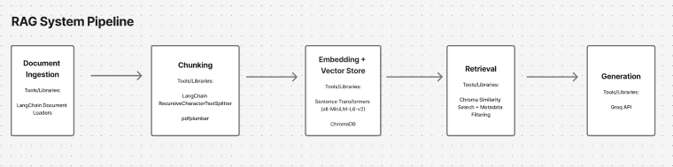

# Project 1 Planning: The Unofficial Guide

> Write this document before you write any pipeline code.
> Your spec and architecture diagram are what you'll use to direct AI tools (Claude, Copilot, etc.) to generate your implementation — the more specific they are, the more useful the generated code will be.
> Update the Retrieval Approach and Chunking Strategy sections if you change your approach during implementation.
> Update this file before starting any stretch features.

---

## Domain

<!-- What domain did you choose? Why is this knowledge valuable and hard to find through official channels? -->
Domain: FGLI Student Experiences and Resources at Northwestern University 

Relevance: FGLI students face challenges that extend beyond academics, including financial barriers, limited access to professional networks, feelings of imposter syndrome, and difficulty navigating university resources. While Northwestern offers some official channels for support, information about these resources is distributed across multiple platforms and often lacks the lived experiences that help students understand how to use them effectively. This RAG system aims to aggregate official Northwestern resources alongside alumni and current student experiences to provide personalized, context-rich answers. By combining institutional knowledge with peer insights, the system can help FGLI students quickly identify proven strategies, discover relevant opportunities, and navigate Northwestern with greater confidence and belonging.

---

## Documents

<!-- List your specific sources: URLs, subreddit names, forum threads, or file descriptions.
     Aim for at least 10 sources that together cover different subtopics or perspectives within your domain. -->

| # | Source | Type | URL or file path |
|---|--------|------|-----------------|
| 1 | Reddit |Thread| [Link to Post](https://www.reddit.com/r/evanston/comments/1min35y/where_to_go_to_get_the_northwestern_experience/)|
| 2 | The Daily Northwestern | News Source | [Link to Page](https://dailynorthwestern.com/2022/11/16/audio/digital-diaries-episode-7-life-as-a-first-generation-and-or-low-income-student/) |
| 3 | Office of Undergraduate Admission| Blog Post | [Link to Post](https://admissionblog.northwestern.edu/2022/11/08/advice-for-fgli-students-northwestern/)|
| 4 | Office of Undergraduate Admission| Blog Post|[Link to Post](https://admissionblog.northwestern.edu/2019/10/22/carter-finding-home-at-northwestern-as-a-first-gen-low-income-student/) |
| 5 | Northwestern Website | Web Page | [Link to Page](https://www.northwestern.edu/studentaffairs/sass/)|
| 6 | Reddit | Thread | [Link to Post](https://www.reddit.com/r/Northwestern/comments/1th3sjt/isolating_firstgen_experience/) |
| 7 | Northwestern Searle Center | Web Page | [Link to Page](https://searle.northwestern.edu/resources/learning-teaching-guides/first-generation-college-student-page.html)|
| 8 | North By Northwestern | Newsletter | [Link to Page](https://northbynorthwestern.com/discountedu-ep-6-intersectionality-latine-fgli/)|
| 9 | Youtube | FGLI Alumni Panel Transcript | [Link to Page](https://www.youtube.com/watch?v=rhX9eEovYug)|
| 10 | Youtube | FGLI Narratives | [Link to Page](https://www.youtube.com/watch?v=jWWHa5XdvDQ)|

---

## Chunking Strategy

<!-- How will you split documents into chunks?
     State your chunk size (in tokens or characters), overlap size, and explain why those
     numbers fit the structure of your documents.
     A review-heavy corpus warrants different chunking than a long FAQ. -->

**Chunk size:**

***Longform Panel Transcripts:***
* Chunk Size: 180 tokens
* Overlap: 50 tokens
* Reasoning: Panels that dive into the FGLI experience at NU are made up of several paragraphs. In order to improve coverage on a chunk's relevance to a user's query, large chunk and overlap size is necessary.

***Official Northwestern Resource Websites:***
* Chunk Size: 100 tokens
* Overlap: None
* Reasoning: Resource pages don't need much context coverage as they are usually made up factual and concise sections (i.e., deadlines, office names, application steps, etc.).

***Reddit Threads:***
* Chunk Size: ~100 tokens
* Overlap: 50
* Reasoning: Usually reddit threads are naturally short, the large overlap is provided to account for longer threads in hopes that the additional context can help the agent present a full experience / anectdote that can better answer a user's query.

**Overlap:**

Provided above

**Reasoning:**

Provided above

---

## Retrieval Approach

<!-- Which embedding model are you using (e.g., all-MiniLM-L6-v2 via sentence-transformers)?
     How many chunks will you retrieve per query (top-k)?
     If you were deploying this for real users and cost wasn't a constraint, what tradeoffs
     would you weigh in choosing a different embedding model — context length, multilingual
     support, accuracy on domain-specific text, latency? -->

**Embedding model:**

all-MiniLM-L6-v2 via sentence-transformers

**Top-k:** 

10

**Production tradeoff reflection:**

Due to cost constraints, we are limited in our selection of embedding models that we can use for this system. The chosen model (all-MiniLM-L6-v2 via sentence-transformers) will truncate input text longer than 256 word pieces which will make retrieval of relevant long-form content less effective. So, we must reduce our original chunk sizes to remain within the model's input limit. This also requires a smaller overlap window, which may reduce the amount of contextual information shared between adjacent chunks and increase the risk of losing semantic continuity across chunk boundaries. This tradeoff ensures that all content is represented in the embedding space. We can mitigate the loss of context from smaller chunk sizes by storing metadata for each chunk, allowing the retrieval system to narrow the search space and retrieve semantically relevant content more effectively.

If we were to scale this system, the best embedding model for our system should excel at cross-domain semantic matching (an embedding model that can represent casual conversations and official resources effectively). A model such as Voyage AI's voyage-4-large would be better suited because it supports long-context inputs and excels at semantic matching across diverse document types.

---

## Evaluation Plan

<!-- List your 5 test questions with their expected correct answers.
     Questions should be specific enough that you can judge whether the system's response
     is right or wrong. "What are good dining halls?" is too vague.
     "What do students say about wait times at [dining hall name] during lunch?" is testable. -->

| # | Question | Expected answer |
|---|----------|-----------------|
| 1 | What are some common experiences as a FGLI at Northwestern University?| Some students reflect on challenges during the first year of college as they acclimate to their new environment. Some students struggle to find their community or may feel like they are not meant for the heavy courseload at the school.|
| 2 | Where can I find my community at Northwestern as a FGLI student?| Affinity-based clubs are a great place to start to connect with people with similar interests and backgrounds. Specific clubs: Society of Hispanic Professional Engineers, QuestBridge, etc.|
| 3 | How can I tackle my imposter syndrome at Northwestern University?| You are not the only one that experiences imposter syndrome during their schooling at Northwestern University. Previous student experiences consist of acknowledging the culture and environment shock that you may experience when you start at Northwestern. Tips for tackling that feeling: reaching out for support (through official channels or through the community you find at Northwestern). Some official sources of support include: Student Enrichment Services, Financial Aid Office, etc. |
| 4 | What resources exist specifically for FGLI students at Northwestern University?| Cited sources of recommended official resources and student recommended resources as shared from panels and blogs.|
| 5 | How can I learn more about the FGLI experience at Northwestern University?| Actionable suggestions, like: reach out to the SES office, attend club fairs to find the right club for you, connect with your advisor to point you in the direction of other resources|

* All responses should cite sources
---

## Anticipated Challenges

<!-- What could go wrong? Name at least two specific risks with reasoning.
     Consider: noisy or inconsistent documents, missing source attribution, off-topic
     retrieval, chunks that split key information across boundaries. -->

1. I am concerned about how the embedding model handles long-form content given its limited input size. Many student experiences are shared through multi-paragraph narratives, and chunking these stories into smaller sections may fragment important context. This could result in retrieved chunks that appear disconnected from the larger narrative, reducing semantic coherence and retrieval quality.

2. Another anticipated challenge is ensuring the system retrieves the most appropriate source for a user's question. Since our knowledge base includes both official Northwestern resources and personal student experiences, the system may return information that is relevant but not necessarily what the user is looking for. For example, it may provide a personal anecdote when a student needs official information, or an official resource when a student is seeking advice from peers who have faced similar challenges.

---

## Architecture

<!-- Draw a diagram of your pipeline showing the five stages:
     Document Ingestion → Chunking → Embedding + Vector Store → Retrieval → Generation
     Label each stage with the tool or library you're using.
     You can use ASCII art, a Mermaid diagram, or embed a sketch as an image.
     You'll use this diagram as context when prompting AI tools to implement each stage. -->

     

---

## AI Tool Plan

<!-- For each part of the pipeline below, describe:
     - Which AI tool you plan to use (Claude, Copilot, ChatGPT, etc.)
     - What you'll give it as input (which sections of this planning.md, which requirements)
     - What you expect it to produce
     - How you'll verify the output matches your spec

     "I'll use AI to help me code" is not a plan.
     "I'll give Claude my Chunking Strategy section and ask it to implement chunk_text()
     with my specified chunk size and overlap" is a plan. -->

**Milestone 3 — Ingestion and chunking:**

**AI Tool**: ChatGPT + Claude

**Input**: I will provide Claude with my chunking strategy for long-form content (150–220 token chunks with 30–50 token overlap) and a sample panel transcript from my data sources. I will work with ChatGPT to narrow down which metadata would be most conducive to improved retrieval quality.

**Expected output**: A Python function that loads the transcript, splits it into chunks according to my specifications, and attaches metadata such as source type and topic.

**Verification**: I will inspect the generated chunks to ensure they remain within the token limit and preserve coherent sections of the student's story.

**Milestone 4 — Embedding and retrieval:**

**AI Tool**: Claude

**Input**: I will provide my chosen embedding model (all-MiniLM-L6-v2), vector store (ChromaDB), and desired retrieval behavior.

**Expected output**: Code that generates embeddings for each chunk, stores them in ChromaDB, and retrieves the top-k most relevant chunks for a user query.

**erification**: I will test queries such as "How do I find community as an FGLI student?" and confirm that the retrieved chunks are relevant to the question.

**Milestone 5 — Generation and interface:**

**AI Tool**: ChatGPT + Claude

**Input**: I will provide a sample user query, retrieved chunks, and my requirement to generate responses using a Groq-hosted LLM.

**Expected output**: A prompt template and generation function that combine retrieved context with the user's question to produce a grounded response.

**Verification**: I will compare the generated response against the retrieved sources to ensure the answer is supported by the provided context and does not introduce unsupported information.
